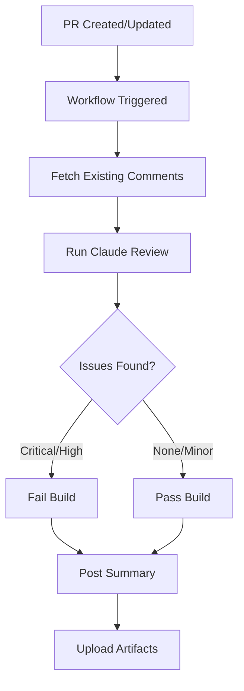

# Claude Code Review - Reusable Workflow PoC

This repository contains a proof of concept for a reusable GitHub Actions workflow that performs automated code reviews using Claude Code.

## Overview

The workflow provides automated code review capabilities powered by Claude AI, specifically configured for .NET projects. It can be called from other repositories to integrate AI-powered code review into your CI/CD pipeline.

## Features

- **Reusable Workflow**: Can be called from any repository in your organization
- **Duplicate Comment Prevention**: Tracks and updates existing review comments instead of creating duplicates
- **Severity-Based Blocking**: Automatically fails builds on critical or high-priority issues
- **Review Summaries**: Posts consolidated review summaries as PR comments
- **Artifact Storage**: Uploads review results for later analysis
- **GitHub App Integration**: Uses GitHub App authentication for enhanced API access

## Usage

### Prerequisites

1. **GitHub App**: Create a GitHub App with the following permissions:
   - Repository permissions:
     - Contents: Read
     - Pull requests: Read & Write
     - Issues: Read & Write

2. **Claude Code OAuth Token**: Obtain from Anthropic

3. **Repository Secrets**: Configure the following secrets in your repository:
   - `TOKEN`: GitHub token with repo access
   - `CLAUDE_CODE_OAUTH_TOKEN`: OAuth token for Claude Code
   - `CLAUDE_CODE_ACTION_APP_ID`: GitHub App ID
   - `CLAUDE_CODE_ACTION_PRIVATE_KEY`: GitHub App private key

### Calling the Workflow

Create a workflow in your repository that calls this reusable workflow on pull request events:

```yaml
name: AI Code Review
on:
  pull_request:
    types: [opened, synchronize, reopened]

jobs:
  code-review:
    uses: cloud-tek/poc-claude-review/.github/workflows/claude-code-review.yml@main
    with:
      pr_number: ${{ github.event.pull_request.number }}
      base_ref: ${{ github.event.pull_request.base.ref }}
    secrets:
      TOKEN: ${{ secrets.GITHUB_TOKEN }}
      CLAUDE_CODE_OAUTH_TOKEN: ${{ secrets.CLAUDE_CODE_OAUTH_TOKEN }}
      CLAUDE_CODE_ACTION_APP_ID: ${{ secrets.CLAUDE_CODE_ACTION_APP_ID }}
      CLAUDE_CODE_ACTION_PRIVATE_KEY: ${{ secrets.CLAUDE_CODE_ACTION_PRIVATE_KEY }}
```

## Workflow Inputs

| Input | Description | Required | Type |
|-------|-------------|----------|------|
| `pr_number` | Pull request number | Yes | number |
| `base_ref` | Base branch reference | Yes | string |

## Workflow Secrets

| Secret | Description | Required |
|--------|-------------|----------|
| `TOKEN` | GitHub token with repo access | Yes |
| `CLAUDE_CODE_OAUTH_TOKEN` | OAuth Token for Claude Code Action | Yes |
| `CLAUDE_CODE_ACTION_APP_ID` | GitHub App ID for Claude Code Action | Yes |
| `CLAUDE_CODE_ACTION_PRIVATE_KEY` | GitHub App Private Key for Claude Code Action | Yes |

## How It Works

1. **Checkout**: Clones the repository with full history
2. **GitHub App Token**: Generates a token from the GitHub App credentials
3. **Fetch Comments**: Retrieves existing bot review comments to prevent duplicates
4. **Claude Review**: Runs Claude Code with .NET-specific review guidelines
5. **Quality Gate**: Checks for critical/high-priority issues and fails if found
6. **Summary**: Posts a summary comment to the PR
7. **Artifacts**: Uploads review results for retention

## Review Severity Levels

The workflow categorizes issues into four severity levels:

- **Critical**: Blocks merge, requires immediate fix
- **High Priority**: Blocks merge, should be addressed before merging
- **Recommendations**: Non-blocking suggestions for improvement
- **Minor/Nitpicks**: Style and minor improvements

## Output

### Review Summary Comment

A sticky comment is posted to the PR with:
- Issue breakdown by severity
- Summary of findings
- Last updated timestamp

### Artifacts

Review results are uploaded as artifacts with:
- Name: `code-review-results-pr-{number}`
- Retention: 30 days
- Contents: JSON file with detailed findings

## Customization

To customize the review behavior, modify the following sections in [claude-code-review.yml](.github/workflows/claude-code-review.yml):

- **Line 70**: Change the skill command (currently `/dotnet-code-review`)
- **Line 80**: Adjust `--max-turns` for longer/shorter reviews
- **Line 81**: Modify allowed tools for the review agent
- **Line 82**: Change the Claude model version

## Example Review Flow



## Contributing

This is a proof of concept repository. For issues or suggestions, please open an issue in this repository.

## License

This project is provided as-is for demonstration purposes.
